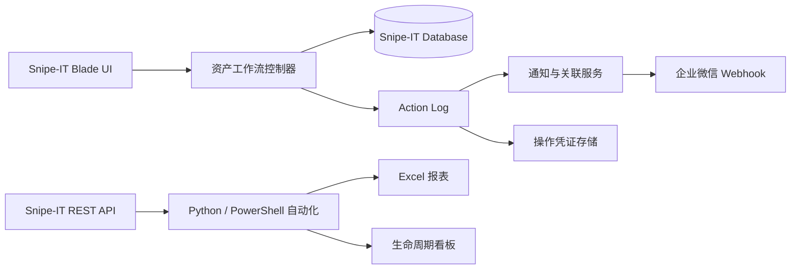

# 架构说明

## 应用内扩展

- 控制器负责待归还、移交、交换、代管和退租事务。
- 独立模型保存待归还、代管和操作凭证等扩展状态。
- Service 类负责附件、资产提及和资产编码等可复用逻辑。
- Observer 或 Notification Channel 负责把操作记录转换为企业微信消息。
- Blade 页面沿用 Snipe-IT v8.1.18 的布局和权限体系。

## 外部自动化

自动化脚本通过 Snipe-IT REST API 或只读数据库查询获取数据，将运行状态、
增量游标和生成文件保存到应用目录之外。API Token 与数据库连接只能来自未提交的
环境文件。

## 数据表扩展

- `actionlog_asset_mentions`
- `asset_pending_returns`
- `actionlog_attachments`
- `asset_custodies`
- 实验版本：`asset_tag_sequences`
